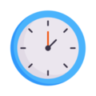
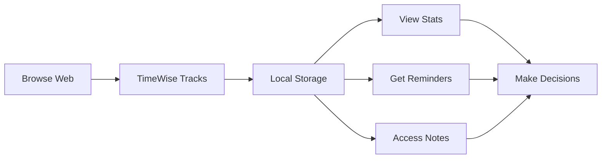

# TimeWise - Focus Time Tracker & Smart Notes

<div align="center">



**Track your focus time and save smart notes—privately in your browser.**

[](link-here)
[](https://github.com/ahsan497/timewise/releases)
[](LICENSE)
[](https://github.com/ahsan497/timewise)

[**Install from Chrome Web Store**](link-here) • [**Report Bug**](https://github.com/ahsan497/timewise/issues) • [**Request Feature**](https://github.com/ahsan497/timewise/issues)

</div>

---

## 📖 About This Repository

This repository contains the **source code** for TimeWise, a Chrome extension for time tracking and note-taking. The code is **publicly available for transparency and security auditing**, but is **not open source**.

### 🔓 Source Available License

- ✅ **View** the code to verify privacy claims
- ✅ **Audit** for security and transparency  
- ✅ **Learn** from the implementation
- ✅ **Report** bugs and suggest improvements
- ❌ **Cannot** modify and redistribute
- ❌ **Cannot** publish to extension stores
- ❌ **Cannot** use commercially without permission

See [LICENSE](LICENSE) for full terms.

### 🎯 Why Source Available?

We believe in **transparency without compromising control**:
- Users can verify we protect their privacy
- Security researchers can audit the code
- Developers can learn from real-world implementation
- We maintain quality control and official distribution

---

## 🌟 Features

<table>
<tr>
<td width="50%">

### ⏱️ Automatic Time Tracking
- Zero-setup automatic tracking
- Real-time session monitoring
- 365-day history retention
- Smart site filtering

### 📝 Smart Notes System
- Unlimited notes per site
- Domain or URL-specific scope
- Visual on-page indicators
- Edit & organize with timestamps

</td>
<td width="50%">

### ⏰ Friendly Reminders
- Custom per-site time limits
- Daily productivity goals
- Non-intrusive notifications
- One reminder per day

### 🔒 100% Private
- All data stored locally
- No external servers
- Zero data collection
- Works completely offline

</td>
</tr>
</table>

---

## 📸 Screenshots

<div align="center">

| Dashboard | Notes | Settings |
|:---------:|:-----:|:--------:|
|  |  |  |
| *Real-time activity tracking* | *Multiple notes per site* | *Powerful controls* |

</div>

---

## 🚀 Installation

### Official Chrome Web Store (Recommended)

<div align="center">

**[⬇️ Install TimeWise from Chrome Web Store](link-here)**

*Automatic updates • Verified by Google • Secure installation*

</div>

### Development Installation (For Testing Only)

> ⚠️ **Note**: Modified versions cannot be distributed. This is for personal testing only.

1. Download the repository
```bash
git clone https://github.com/ahsan497/timewise.git
cd timewise
```

2. Load in Chrome
   - Open `chrome://extensions/`
   - Enable "Developer mode"
   - Click "Load unpacked"
   - Select the `timewise` directory

---

## 📊 How It Works



**Key Points:**
- Tracking happens automatically in the background
- Data is saved to your browser's local storage every 5 seconds
- Everything stays on your device - never uploaded anywhere
- You control what's tracked with the no-track list

---

## 🔐 Privacy & Security

### Our Privacy Promise

<table>
<tr>
<td align="center">✅</td>
<td><strong>100% Local Storage</strong><br/>All data stays on your device</td>
<td align="center">✅</td>
<td><strong>Zero Data Collection</strong><br/>We don't collect anything</td>
</tr>
<tr>
<td align="center">✅</td>
<td><strong>No External Servers</strong><br/>Never sends data anywhere</td>
<td align="center">✅</td>
<td><strong>No Analytics</strong><br/>Zero tracking or telemetry</td>
</tr>
<tr>
<td align="center">✅</td>
<td><strong>Open for Audit</strong><br/>Source code is public</td>
<td align="center">✅</td>
<td><strong>No Ads Ever</strong><br/>Completely ad-free</td>
</tr>
</table>

### What We Store (Locally Only)

| Data Type | Example | Why |
|-----------|---------|-----|
| Website domains | "example.com" | Track time per site |
| Time duration | 45 minutes | Show statistics |
| Your notes | "Research for project" | Save information |
| Settings | Time limits, preferences | Customize behavior |

### What We DON'T Store

- ❌ Page content or personal information
- ❌ Passwords or form data
- ❌ Search queries or URLs
- ❌ Browsing history details
- ❌ Any identifiable information

**[📄 Read Full Privacy Policy](https://ahsan497.github.io/timewise/PRIVACY_POLICY)**

---

## 💡 Use Cases

<details>
<summary><strong>👨‍🎓 For Students</strong></summary>

- Track study time across learning platforms
- Take notes on research sources and articles
- Set limits on social media during study time
- Review weekly study patterns and productivity
- Export time logs for accountability partners

</details>

<details>
<summary><strong>👨‍💼 For Professionals</strong></summary>

- Log time spent on work tools and platforms
- Track meeting durations and productivity
- Note important information per project site
- Export time logs for timesheets and billing
- Set boundaries with time limits

</details>

<details>
<summary><strong>🎯 For Focus Enthusiasts</strong></summary>

- Understand your browsing habits and patterns
- Build healthier screen time habits
- Stay focused with gentle reminders
- Keep organized notes across the web
- Set daily productivity goals

</details>

<details>
<summary><strong>🔍 For Researchers</strong></summary>

- Track time spent on research websites
- Keep detailed notes per source
- Organize research by domain or URL
- Export data for analysis
- Review historical research patterns

</details>

---

## 🛠️ Technical Stack

<div align="center">


</div>

### Built With
- **Chrome Extension Manifest V3** - Latest extension standard
- **Pure JavaScript** - No frameworks, maximum performance
- **Chrome APIs**: `storage.local`, `tabs`, `alarms`, `notifications`
- **Local-first architecture** - Everything stays on your device

### Performance
- **Lightweight**: < 100KB total size
- **Efficient**: Minimal CPU and memory usage
- **Fast**: Instant load times
- **Reliable**: Auto-save every 5 seconds

---

## 🐛 Reporting Issues

Found a bug? We want to fix it!

**Before reporting:**
1. Check [existing issues](https://github.com/ahsan497/timewise/issues)
2. Update to the latest version
3. Try disabling other extensions

**When reporting:**
- Use the [bug report template](.github/ISSUE_TEMPLATE/bug_report.md)
- Include Chrome version
- Describe steps to reproduce
- Add screenshots if relevant

**[🐛 Report a Bug](https://github.com/ahsan497/timewise/issues/new?template=bug_report.md)**

---

## 💡 Feature Requests

Have an idea? We'd love to hear it!

**Popular requests:**
- [ ] Dark mode theme
- [ ] Weekly/monthly reports
- [ ] CSV export option
- [ ] Custom categories
- [ ] Keyboard shortcuts

**[💡 Request a Feature](https://github.com/ahsan497/timewise/issues/new?template=feature_request.md)**

---

## 🤝 Contributing

We welcome **bug reports, feature requests, and suggestions**!

### What You Can Do
- ✅ Report bugs and issues
- ✅ Suggest new features
- ✅ Propose improvements
- ✅ Help with documentation
- ✅ Share ideas and feedback

### What Requires Permission
- ❌ Code modifications
- ❌ Forks for distribution
- ❌ Commercial use

See [CONTRIBUTING.md](CONTRIBUTING.md) for guidelines.

---

## 📞 Support & Contact

<div align="center">

### Need Help?

[💬 GitHub Discussions](https://github.com/ahsan497/timewise/discussions) • 
[📧 Email Support](mailto:ahsantariq497@gmail.com) • 
[ LinkedIn](https://www.linkedin.com/in/ahsan-tariq528/)

**Average Response Time: 24-48 hours**

</div>

---

## 📈 Roadmap

### Version 1.1 (Q2 2026)
- [ ] Dark mode theme
- [ ] Enhanced statistics and charts
- [ ] CSV export functionality
- [ ] Performance improvements

### Version 1.2 (Q3 2026)
- [ ] Custom categories for sites
- [ ] Keyboard shortcuts
- [ ] Advanced filtering options
- [ ] Mobile companion app (view-only)

### Version 2.0 (Q4 2026)
- [ ] Optional cloud sync (opt-in)
- [ ] Multiple profiles
- [ ] Team/family sharing
- [ ] Advanced analytics

**[📊 View Full Roadmap](https://github.com/ahsan497/timewise/projects)**

---

## ⭐ Show Your Support

If you find TimeWise useful:

<div align="center">

⭐ **Star this repository**  
✍️ **[Write a review on Chrome Web Store](link-here)**  
🐦 **[Share on Twitter](https://twitter.com/intent/tweet?text=Check%20out%20TimeWise)**  
📧 **Tell your friends**

**Thank you for your support! 🙏**

</div>

---

## 📜 License & Legal

### License
This project is under a **Source Available License** - see [LICENSE](LICENSE) for details.

**TL;DR**: You can view and audit the code, but cannot modify, redistribute, or use it commercially without permission.

### Why Not Open Source?
We believe in transparency, but also in maintaining:
- **Quality control** - Official version is tested and secure
- **Brand protection** - Avoid confusing unofficial versions  
- **Sustainability** - Ability to monetize in the future if needed
- **User trust** - Single official distribution channel

### Fair Use
Educational references, articles, and reviews are welcome with proper attribution.

---

## 🙏 Acknowledgments

- Chrome Extension APIs and documentation
- All users who provide feedback and support
- The privacy-focused software community

---

## 📊 Stats

<div align="center">


**[View Analytics](https://github.com/ahsan497/timewise/graphs/traffic)**

</div>

---

<div align="center">

**Made with ❤️ for privacy-conscious productivity enthusiasts**

[LinkedIn](https://www.linkedin.com/in/ahsan-tariq528/) • 
[Email](mailto:ahsantariq497@gmail.com)

© 2026 [Ahsan Tariq]. All rights reserved.

</div>
